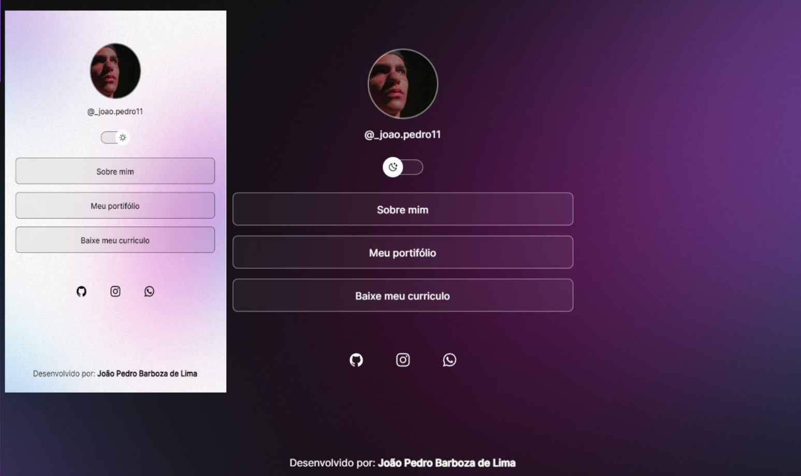

# Projeto - Meu site

Esse é meu pequeno projeto sobre um site que eu desenvolvi para mostrar meu portifolio e minhas habilidades.

## Tecnologias Utilizadas

- HTML5
- CSS3
- JavaScript
- Git e Github
- Figma

## Captura de tela - Fundo preto e branco - mobile e desktop

